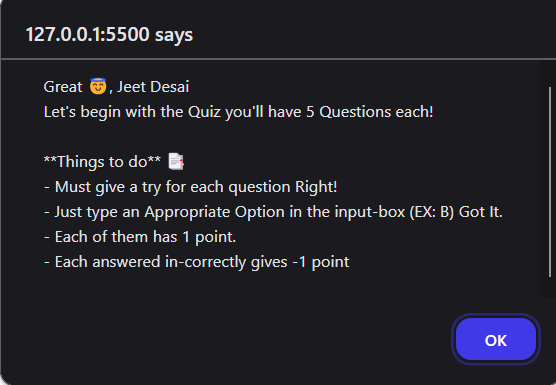
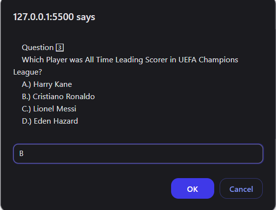
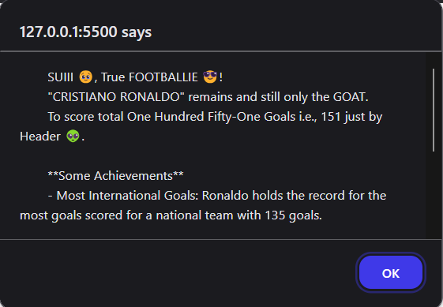
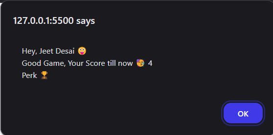

### 🎯 Mini Project Exercise - Quizera 🤖

Welcome to the **Quiz App** project! 🚀 This simple yet interactive quiz game is designed to test your knowledge of football legends ⚽ while reinforcing JavaScript fundamentals.

---

## 📜 Features

- 🧩 Covers the basics of:
  - Data types: `String`, `Number`, `Boolean`
  - Variable keywords: `var`, `let`, `const`
  - Dialog boxes: `alert`, `prompt`, `confirm`
- 🎮 Fun and interactive user experience.
- 🏆 Dynamic score tracking with performance evaluation (perks included)!

---

## 🚀 Getting Started

### Prerequisites

Ensure you have the following:

- A web browser (e.g., Chrome, Firefox, Edge).
- Optionally, a live server to run the project.

### Folder Structure

```
exercise-project-I/
├── index.html  # Main HTML file
├── script.js   # JavaScript logic for the quiz
└── screenshots/
        ├── Welcome-Message.png
        ├── Question.png
        ├── Answer-Response-Correct.png
        ├── Final-Score.png
```

---

## 📖 How to Play

1. Clone this repository to your local machine:
   ```bash
   git clone https://github.com/jdsteadycode/project-exercise.git
   ```
2. Open the `index.html` file in your browser or use a live server.
3. Follow the on-screen instructions to answer the quiz questions.
4. Input your answers in the prompt (e.g., `A`, `B`, `C`, `D`).
5. View your score and perk after completing the quiz.

---

## 🛠️ Built With

- **HTML5** for structuring the content.
- **JavaScript** for dynamic interactivity.

---

## 🎨 Screenshots

### Welcome Message



### Quiz Question



### Quiz Response (Correct Answer)



### Final Score



---

## 🤔 Future Enhancements

- Add a timer for each question.
- Include more dynamic questions using JavaScript functions.
- And many more...

---

## 🙌 Acknowledgments

Special thanks to **Lionel Messi**, **Cristiano Ronaldo**, and other football legends for inspiring this quiz! ⚽💪

---

## 📧 Contact

For any suggestions or feedback, feel free to reach out:

- GitHub: [@jdsteadycode](https://github.com/jdsteadycode)
- Email: [desaijeet11@gmail.com](desaijeet11@gmail.com)

---
